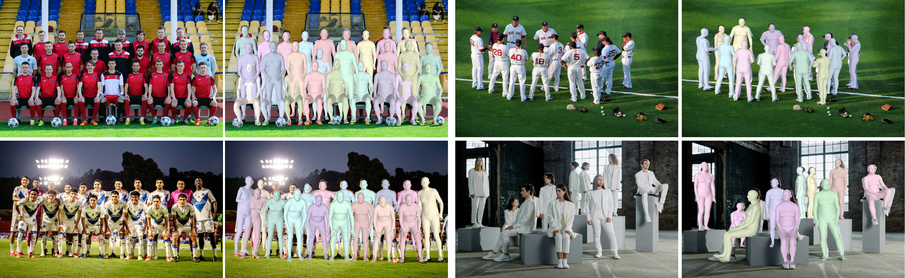
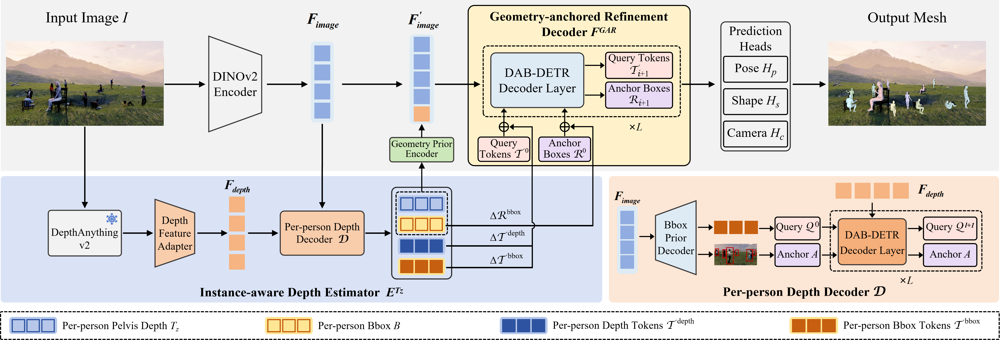

<h1 align="center">
  DGG-HMR: Multi-Person Human Mesh Recovery with<br>
  Depth-Guided Geometric Anchoring<br>
  (ICML 2026)
</h1>

<p align="center">
  <b>Yanjie Li</b> &nbsp;
  <b>Le Hui</b> &nbsp;
  <b>Yali Peng</b> &nbsp;
  <b>Shigang Liu*</b>
</p>

<div align="center">
  <a href="https://pytorch.org/get-started/locally/"></a>
  
</div>

<br>

<p align="center">
  
</p>

## Overview

<p align="center">
  
</p>

## News :triangular_flag_on_post:

[2026/05/01] DGG-HMR has been accepted to ICML 2026.

## Installation

We tested DGG-HMR with the following environment:

| Package | Version |
| --- | --- |
| Python | 3.11.14 |
| CUDA | 12.1 |
| PyTorch | 2.4.1+cu121 |
| TorchVision | 0.19.1+cu121 |
| TorchAudio | 2.4.1+cu121 |
| xFormers | 0.0.28.post1 |
| Accelerate | 1.10.0 |

1. Clone the repo and create a conda environment.
```bash
git clone https://github.com/Nebulae411/DGG-HMR.git
cd DGG-HMR
conda create -n dgg-hmr python=3.11 -y
conda activate dgg-hmr
```

2. Install [PyTorch](https://pytorch.org/) and [xFormers](https://github.com/facebookresearch/xformers). Please adapt the CUDA version to your local system if needed.
```bash
conda install pytorch==2.4.1 torchvision==0.19.1 torchaudio==2.4.1 pytorch-cuda=12.1 -c pytorch -c nvidia

pip install -U xformers==0.0.28.post1 --index-url https://download.pytorch.org/whl/cu121
```

3. Install the remaining Python dependencies.
```bash
pip install -r requirements.txt
```

4. You may need to patch `chumpy` for Python 3.11 compatibility. Please follow [this guidance](docs/fix_chumpy.md) if you encounter `chumpy` import errors.

5. Prepare external code and model assets as described below. In particular, DGG-HMR imports the local `Depth-Anything-V2` source tree at runtime, so cloning Depth-Anything-V2 is required even though it is not vendored in this repository.

## External Code, Models, and Weights

This repository does not include third-party source repositories, third-party checkpoints, SMPL assets, datasets, or DGG-HMR checkpoints. Please download or clone them separately according to their original licenses.

1. Clone Depth-Anything-V2 code under the project root. The current DGG-HMR model imports `Depth-Anything-V2/depth_anything_v2` at runtime.
```bash
git clone https://github.com/DepthAnything/Depth-Anything-V2.git Depth-Anything-V2
```

2. Download SMPL assets from the official SMPL websites and place them under `${Project}/weights/smpl_data/smpl`. The current code uses gendered SMPL layers by default, so prepare `SMPL_NEUTRAL.pkl`, `SMPL_MALE.pkl`, `SMPL_FEMALE.pkl`, `smpl_mean_params.npz`, `body_verts_smpl.npy`, and `J_regressor_h36m_correct.npy`.
   - SMPLX assets are not used by the current codebase and do not need to be prepared.

3. Download DINOv2 pretrained weights from the official DINOv2 repository. We use `ViT-B/14 distilled (without registers)`. Put `dinov2_vitb14_pretrain.pth` under `${Project}/weights/dinov2`. This file is only needed when training from a DINOv2 initialization.

4. Download Depth-Anything-V2 checkpoints from the official Depth-Anything-V2 release. The default model uses the DAV2 ViT-B branch, so put `depth_anything_v2_vitb.pth` under `${Project}/weights/dav2`.

5. Download DGG-HMR checkpoints from [Baidu Netdisk](https://pan.baidu.com/s/1HLo9JkOTG3plxmgUVD80DA?pwd=v45y) and put them under `${Project}/weights/dgg-hmr`.
   - `dgg_672_vitb.pth`: default checkpoint for demo and AGORA evaluation.
   - `dgg_672_vitb_3dpw.pth`: checkpoint used by the 3DPW, MuPoTS, and CMU evaluation configs.
   - The `896` checkpoints are optional unless you explicitly switch configs to them.

Now the `weights` directory structure should be like this. 

```
${Project}
|-- weights
    |-- dinov2
        `-- dinov2_vitb14_pretrain.pth
    |-- dav2
        `-- depth_anything_v2_vitb.pth
    |-- dgg-hmr
        |-- dgg_672_vitb.pth
        |-- dgg_672_vitb_3dpw.pth
        |-- dgg_896_vitb.pth
        `-- dgg_896_vitb_3dpw.pth
    `-- smpl_data
        `-- smpl
            |-- body_verts_smpl.npy
            |-- J_regressor_h36m_correct.npy
            |-- smpl_mean_params.npz
            |-- SMPL_NEUTRAL.pkl
            |-- SMPL_FEMALE.pkl
            `-- SMPL_MALE.pkl
```

## Data Preparation

DGG-HMR follows the [SAT-HMR](https://github.com/ChiSu001/SAT-HMR) data preparation protocol for the shared datasets, except that Human3.6M is not used. We do not redistribute dataset images or preprocessed annotations.

Place datasets under `${Project}/data` by default, or change the root in `${Project}/configs/paths.py`. See [docs/data_preparation.md](docs/data_preparation.md) for the full expected structure. In short:
```
data/
|-- agora/       # train, validation, test, and SMPL annotations
|-- bedlam/      # default training uses bedlam_smpl_train_1fps.npz
|-- coco/
|-- mpii/
|-- crowdpose/
|-- 3dpw/
|-- mupots/
`-- cmu/
```

For MuPoTS-3D and CMU Panoptic evaluation, download the official datasets and follow their official preparation instructions.

## Inference on Images
<h4> Inference with 1 GPU</h4>

We provide several demo images in `${Project}/demo/images`. You can run DGG-HMR on all demo images on a single GPU via:


```bash
python main.py --mode infer --cfg demo
```

Results with overlayed meshes and top/side views will be saved in `${Project}/demo_results/images`.

You can specify your own inference configuration by modifing `${Project}/configs/run/demo.yaml`:

- `input_dir` specifies the input image folder.
- `output_dir` specifies the output folder.
- `conf_thresh` specifies a list of confidence thresholds used for detection. DGG-HMR will run inference using thresholds in the list, respectively.
- `infer_batch_size` specifies the batch size used for inference (on a single GPU).

<h4> Inference with Multiple GPUs</h4>

You can also try distributed inference on multiple GPUs if your input folder contains a large number of images. 
Since we use [🤗 Accelerate](https://huggingface.co/docs/accelerate/index) to launch our distributed configuration, first you may need to configure [🤗 Accelerate](https://huggingface.co/docs/accelerate/index) for how the current system is setup for distributed process. To do so run the following command and answer the questions prompted to you:

```bash
accelerate config
```

Then run:
```bash
accelerate launch main.py --mode infer --cfg demo
```

## Training

<h4> Training with Multiple GPUs</h4>

We use [🤗 Accelerate](https://huggingface.co/docs/accelerate/index) to launch our distributed configuration, first you may need to configure [🤗 Accelerate](https://huggingface.co/docs/accelerate/index) for how the current system is setup for distributed process. To do so run the following command and answer the questions prompted to you:

```bash
accelerate config
```

To train on all datasets, run:

```bash
accelerate launch main.py --mode train --cfg train_all
```

The default training config uses AGORA, BEDLAM 1fps, COCO, MPII, and CrowdPose. If computational resources are sufficient, BEDLAM 6fps can also be used by changing the BEDLAM split in `configs/run/train_all.yaml`.

<h4> Monitor Training Progress</h4>

Training logs and checkpoints will be saved in the `${Project}/outputs/logs` and `${Project}/outputs/ckpts` directories, respectively.

You can monitor the training progress using TensorBoard. To start TensorBoard, run:

```bash
tensorboard --logdir=${Project}/outputs/logs
```

## Evaluation

<h4> Evaluation with 1 GPU</h4>

Evaluation results will be saved in `${Project}/results/${cfg_name}/evaluation`. The default configs use the following checkpoints:

- AGORA: `${Project}/weights/dgg-hmr/dgg_672_vitb.pth`
- 3DPW, MuPoTS, and CMU: `${Project}/weights/dgg-hmr/dgg_672_vitb_3dpw.pth`

```bash
# Evaluate on AGORA validation
python main.py --mode eval --cfg eval_ab

# Evaluate on 3DPW test
python main.py --mode eval --cfg eval_3dpw

# Evaluate on MuPoTS test
python main.py --mode eval --cfg eval_mupots

# Evaluate on CMU Panoptic test
python main.py --mode eval --cfg eval_cmu

# Generate AGORA test submission files
# This will generate a zip file in `${Project}/results/test_agora/evaluation/agora_test/thresh_0.5`
# which can be submitted to [AGORA Leaderboard](https://agora-evaluation.is.tuebingen.mpg.de/)
python main.py --mode eval --cfg test_agora
```

AGORA validation reports detection and mesh metrics plus depth-related metrics. 3DPW reports standard 3D mesh/joint metrics. MuPoTS reports PCK metrics. CMU reports matched and penalty-based MPJPE metrics.

<h4> Evaluation with Multiple GPUs</h4>

Distributed evaluation is also supported with `accelerate`.

```bash
# Multi-GPU configuration
accelerate config
# Evaluation
accelerate launch main.py --mode eval --cfg ${cfg_name}
```

## Citing

If you find this code useful for your research, please consider citing our paper:
```bibtex
@inproceedings{
anonymous2026dgghmr,
title={{DGG}-{HMR}: Multi-Person Human Mesh Recovery with Depth-Guided Geometric Anchoring},
author={Yanjie Li and Le Hui and Yali Peng and Shigang Liu},
booktitle={Forty-third International Conference on Machine Learning},
year={2026},
url={https://openreview.net/forum?id=mJr1VDMOf2}
}
```

## Acknowledgement
This repository is primarily built upon [SAT-HMR](https://github.com/ChiSu001/SAT-HMR). We sincerely thank the SAT-HMR authors for releasing their codebase. We also thank the excellent projects [DINOv2](https://github.com/facebookresearch/dinov2), [DAB-DETR](https://github.com/IDEA-Research/DAB-DETR), [Depth-Anything-V2](https://github.com/DepthAnything/Depth-Anything-V2), and [Accelerate](https://huggingface.co/docs/accelerate/index).
